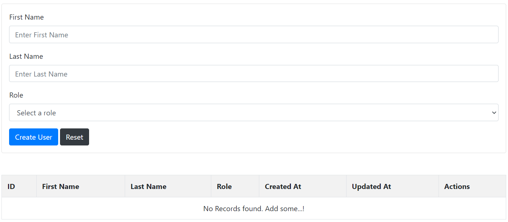
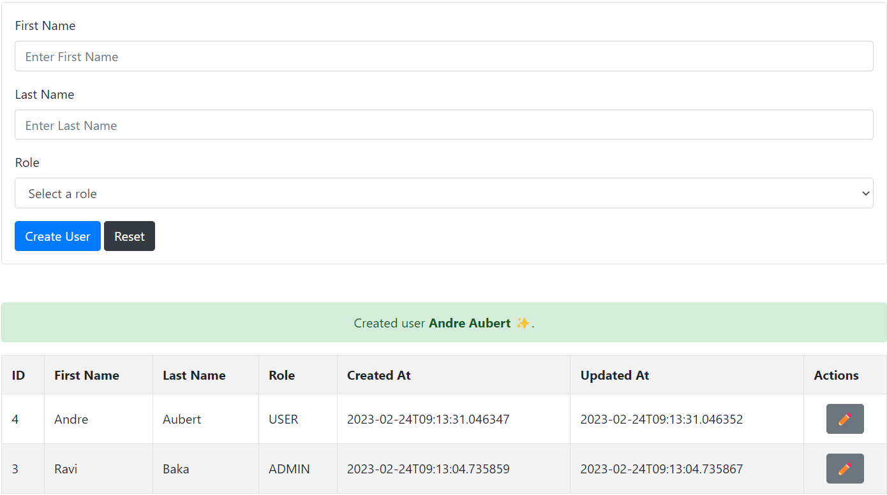
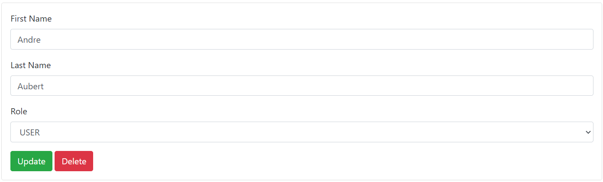

docker build -f Dockerfile -t springboot-thymeleaf-crud-jdk11 . \
docker tag springboot-thymeleaf-crud-jdk11 ravibaka/springboot-thymeleaf-crud-jdk11:latest \
docker push ravibaka/springboot-thymeleaf-crud-jdk11:latest \
docker run -p 8080:8080 springboot-thymeleaf-crud-jdk11 

http://localhost:8080/

